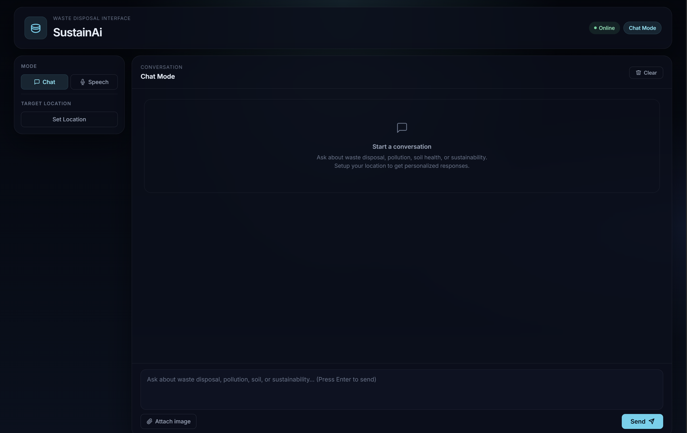
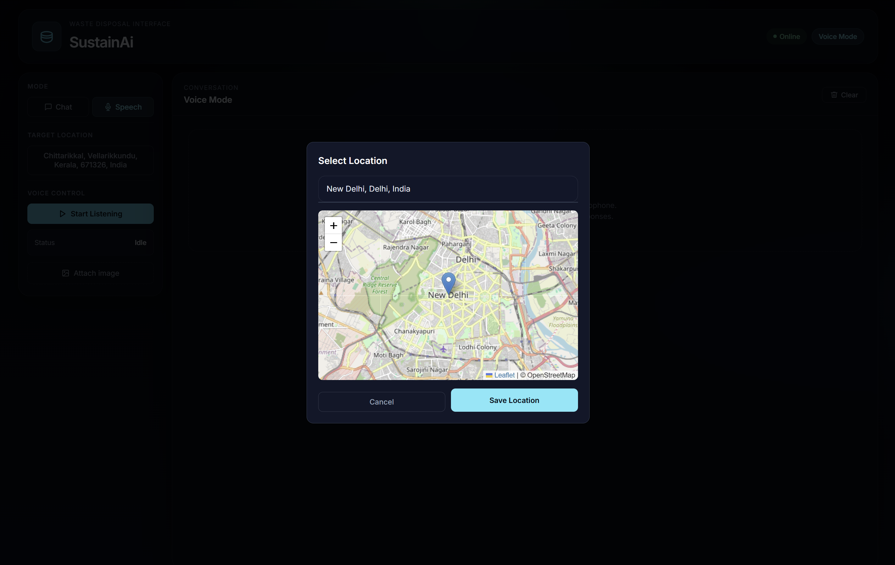
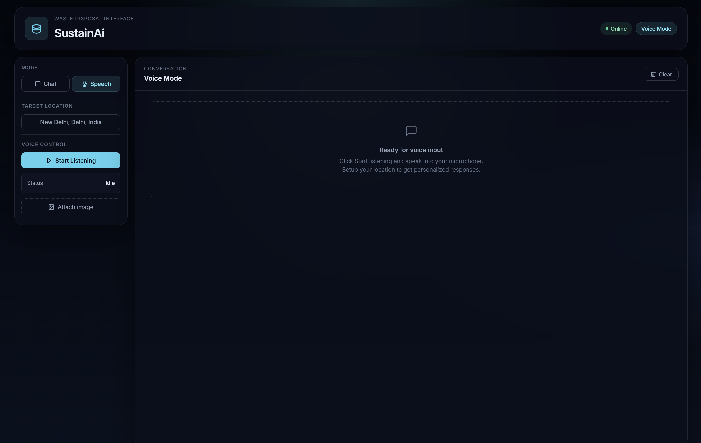
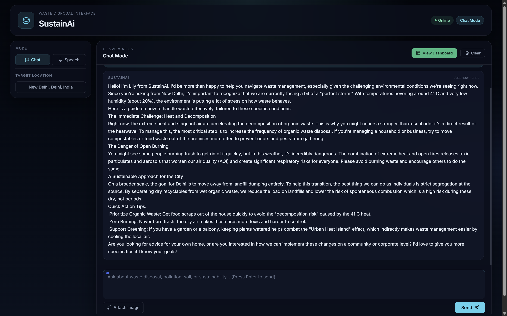
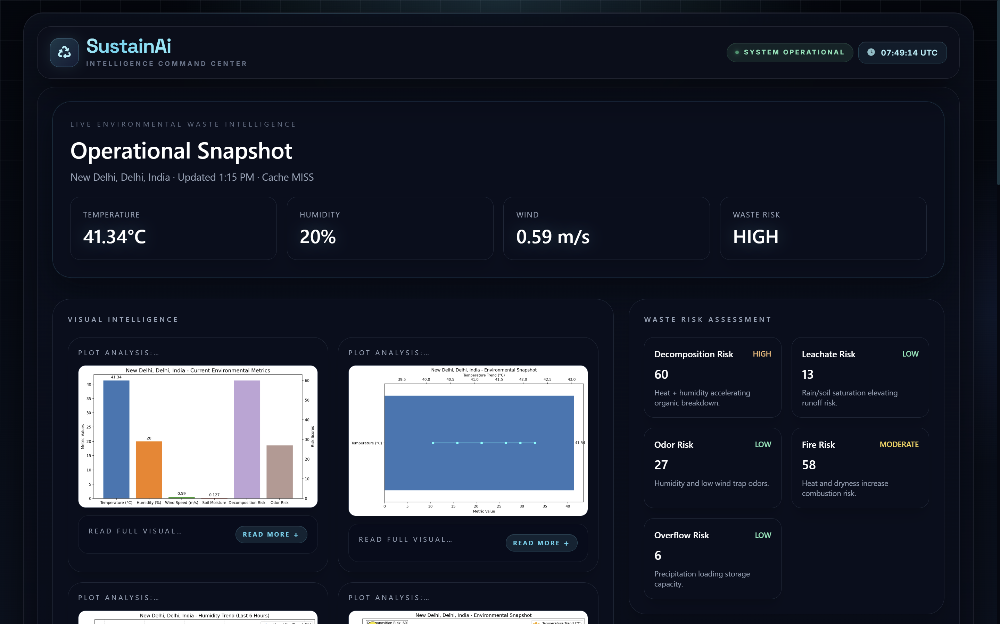
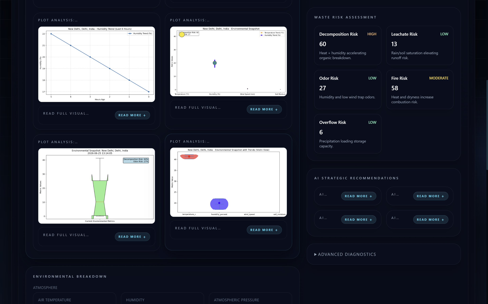
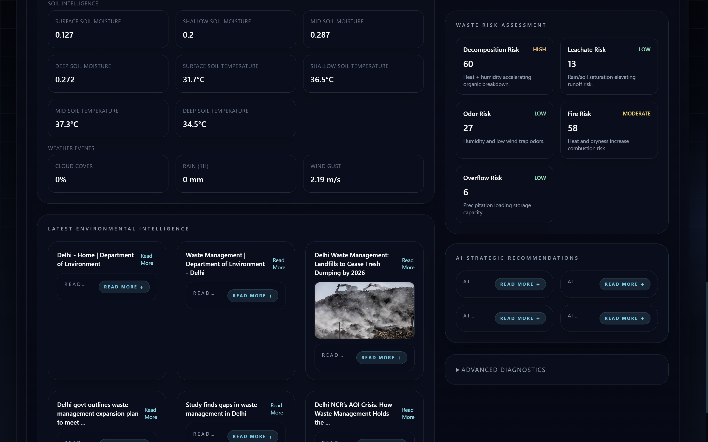

# 🌿 SustainAi - Waste Disposal Management System

[](https://www.python.org/)
[](https://flask.palletsprojects.com/)
[](https://ollama.ai/)


> **An advanced, AI-driven waste disposal management system providing autonomous environmental analysis, live ecosystem intelligence, and decision-support tools.**

---

## 📋 Table of Contents

- [Overview](#-overview)
- [Key Features](#-key-features)
- [Architecture](#-architecture)
- [Screenshots](#-screenshots)
- [Installation](#-installation)
- [Usage](#-usage)
- [Project Structure](#-project-structure)
- [Technology Stack](#-technology-stack)
- [Contributors](#-contributors)

---

## 🌟 Overview

**SustainAi** is an intelligent, multi-agent system designed to revolutionize waste disposal management through autonomous environmental analysis and real-time decision support. By leveraging a sophisticated master-agent architecture, SustainAi empowers users to make informed, sustainable waste management decisions with ease.

The system combines **environmental data fetching**, **image analysis**, **research automation**, and **interactive dashboards** into a seamless, user-friendly interface. Whether you're a municipal authority, environmental consultant, or sustainability enthusiast, SustainAi provides the intelligence you need to manage waste effectively.

---

## 🚀 Key Features

### 🤖 Intelligent Agent Orchestration
- **Autonomous Environmental Analysis**: Fetches and processes real-time environmental data (temperature, humidity, soil moisture, air quality, etc.)
- **Multi-Agent Architecture**: Specialized agents work together to provide comprehensive insights
- **Smart Decision Making**: Master agent intelligently orchestrates sub-agents based on user queries

### 📊 Data Visualization & Reporting
- **Interactive Dashboards**: Generate comprehensive, executive-grade dashboards with real-time metrics
- **Advanced Plotting**: Create multi-chart visualizations including bar charts, soil profiles, weather details, and risk assessments
- **Research Integration**: Automatically fetch and summarize latest environmental research and policies

### 🎤 Multi-Modal Interface
- **Chat Interface**: Natural language command center for text-based interaction
- **Voice Interface**: Integrated speech-to-text (STT) and text-to-speech (TTS) for hands-free operation
- **Image Analysis**: Upload and analyze waste images for automated classification and insights

### 🔍 Research & Insights
- **Deep Research Capabilities**: Perform internet research on waste management policies and environmental topics
- **AI-Generated Insights**: Receive actionable recommendations based on environmental data
- **Risk Assessment**: Automatic calculation of decomposition, leachate, odor, fire, and overflow risks

### 📱 User Experience
- **Responsive Design**: Works seamlessly on desktop and mobile devices
- **Location-Based Intelligence**: Get personalized insights based on your geographical location
- **Real-Time Updates**: Live dashboard updates with every query

---

## 🏗️ Architecture

SustainAi is built on a sophisticated **master-agent architecture** where the `WasteDispoMaster` orchestrates several specialized agents:

```
┌─────────────────────────────────────────────────────────────────┐
│                         User Input                              │
└─────────────────────────────────────────────────────────────────┘
                              │
                              ▼
┌─────────────────────────────────────────────────────────────────┐
│                      WasteDispoMaster                           │
│                    (Master Orchestrator)                        │
└─────────────────────────────────────────────────────────────────┘
                              │
                              ▼
┌─────────────────────────────────────────────────────────────────┐
│                    Agent Orchestration                          │
└─────────────────────────────────────────────────────────────────┘
        │           │           │           │           │
        ▼           ▼           ▼           ▼           ▼
┌───────────┐ ┌───────────┐ ┌───────────┐ ┌───────────┐ ┌───────────┐
│   ENV     │ │  VISION   │ │  PLOTTER  │ │ RESEARCH  │ │CLASSIFIER │
│  Agent    │ │  Agent    │ │  Agent    │ │  Agent    │ │  Agent    │
└───────────┘ └───────────┘ └───────────┘ └───────────┘ └───────────┘
     │             │             │             │             │
     └─────────────┴─────────────┴─────────────┴─────────────┘
                              │
                              ▼
┌─────────────────────────────────────────────────────────────────┐
│                      Dashboard Module                           │
│              Generates Interactive HTML Dashboard               │
└─────────────────────────────────────────────────────────────────┘
```

### 🧠 Core Components

| Agent | Description | Type |
|-------|-------------|------|
| **Environmental Data Fetcher** | Real-time weather, soil, and environmental data | DATA |
| **Vision Agent** | Analyzes and explains images of waste and environments | TEXT |
| **AI Plotter** | Creates high-end data visualizations and charts | FILE |
| **Research Analyzer** | Deep internet research on waste/chemicals | REPORT |
| **Technical Summarizer** | Condenses complex logs into executive summaries | TEXT |
| **Classifier Agent** | Classifies waste using local YOLO model | IMAGE |
| **Dashboard Module** | Generates comprehensive Intelligence Command Center | FILE |

### 🔄 Data Flow

1. **User Input** → Master Agent interprets intent
2. **Agent Selection** → Master orchestrates appropriate agents
3. **Data Collection** → Agents fetch/process data
4. **Analysis & Synthesis** → Results are compiled and summarized
5. **Dashboard Generation** → HTML dashboard is created/updated
6. **Response** → User receives natural language summary with dashboard link

---

## 📸 Screenshots

### 💬 Chat Interface


*AI-powered conversational assistant for waste management and environmental sustainability. Supports image uploads, location-aware recommendations, and instant responses.*

---

### 📍 Interactive Location Selection


*Integrated map-based location picker for selecting any region. Environmental analysis and recommendations are personalized using the selected location.*

---

### 🎙️ Voice Assistant


*Hands-free voice interaction with speech recognition, text-to-speech responses, and image support for accessibility.*

---

### 🤖 AI Environmental Assistant


*Location-aware environmental guidance powered by AI, delivering waste management recommendations based on real-time weather and environmental conditions.*

---

### 📊 Environmental Intelligence Dashboard


*Operational dashboard displaying live environmental metrics, waste risk assessment, AI-generated visual analytics, and sustainability insights.*

---

### 📈 Advanced Analytics & Risk Assessment


*Detailed environmental visualizations, decomposition risk analysis, soil intelligence, AI strategic recommendations, and operational diagnostics.*

---

### 📰 Environmental Intelligence Feed


*Latest environmental research, waste management policies, government updates, and AI-curated sustainability news integrated into the dashboard.*

---

## 🛠️ Installation

### Prerequisites

- **Python 3.10+**
- **Ollama** (for local LLM execution)
- **Git** (for cloning the repository)

### Step-by-Step Setup

1. **Clone the Repository**
   ```bash
   git clone https://github.com/nosij-playz/sustain-ai.git
   cd Sustain-ai
   ```

2. **Create a Virtual Environment (Recommended)**
   ```bash
   python -m venv venv
   source venv/bin/activate  # On Windows: venv\Scripts\activate
   ```

3. **Install Dependencies**
   ```bash
   pip install -r requirements.txt
   ```

4. **Install Ollama and Pull Required Models**
   ```bash
   # Install Ollama (visit https://ollama.ai for instructions)
   ollama pull qwen3-coder:480b-cloud
   ollama pull gpt-oss:120b-cloud
   ollama pull gemma4:31b-cloud
   ollama pull gpt-oss:20b-cloud
   ```

5. **Configure Environment Variables**
   Create a `.env` file in the root directory:
   ```env
   SECRET_KEY=your_super_secret_key_here
   SUSTAINAI_SYSTEM_NAME=SustainAi
   SUSTAINAI_MASTER_NAME=Lily
   LOCATIONIQ_KEY=your_locationiq_api_key  # Optional, for location search
   ```

6. **Run the Application**
   ```bash
   python app.py
   ```

7. **Access the Interface**
   Open your browser and navigate to: `http://localhost:5000`

---

## 💻 Usage

### Web Interface (Recommended)

The Flask-based web interface provides the most comprehensive experience:

```bash
python app.py
```

**Features:**
- 💬 Chat interface with natural language processing
- 🎤 Voice mode with STT/TTS integration
- 📸 Image upload and analysis
- 📊 Real-time dashboard updates
- 📍 Location-based intelligence

### Command Line Interface

For users who prefer terminal-based interaction:

```bash
python main.py
```

**Features:**
- 💬 Text-based chat interaction
- 🎤 Voice mode support
- 🔍 Research and analysis capabilities

### Example Queries

Try these sample queries to explore SustainAi's capabilities:

| Query | Expected Output |
|-------|-----------------|
| *"What's the current temperature and humidity?"* | Real-time environmental metrics |
| *"Give me a full environmental report"* | Comprehensive dashboard with plots |
| *"Search for latest waste management policies"* | Research results with policy updates |
| *"Classify this waste image"* | Object detection and classification |
| *"Show me environmental plots"* | Visual data representations |

---

## 📁 Project Structure

```
Waste_Man/
├── app.py                          # Flask web server and API endpoints
├── main.py                         # Unified CLI application entry point
├── requirements.txt                # Python dependencies
├── .env                            # Environment variables (create manually)
│
├── backend/                        # Core backend logic
│   ├── Agents/                     # Agent implementations
│   │   ├── Master.py               # Master orchestrator agent
│   │   ├── env_live.py             # Environmental data fetcher
│   │   ├── summarizer.py           # Technical text summarizer
│   │   ├── Plotter.py              # AI-powered plot generator
│   │   ├── research.py             # Research analyzer
│   │   └── classifier_agent.py     # YOLO-based waste classifier
│   │
│   ├── data_fetch/                 # Data retrieval modules
│   │   └── env_data.py             # Environmental data APIs
│   │
│   ├── image/                      # Vision and image analysis
│   │   └── explain.py              # Image explanation logic
│   │
│   ├── output/                     # Output generation
│   │   ├── Dashboard.py            # Dashboard HTML generator
│   │   ├── Plotter.py              # Plot generation
│   │   └── tts_and_sst.py          # Speech processing
│   │
│   ├── interface/                  # Web interface files
│   │   ├── base.html               # Dashboard template
│   │   └── dashboard.html          # Generated dashboard (auto-created)
│   │
│   └── display/                    # Static assets (auto-generated)
│       ├── *.png                   # Generated plots and images
│       └── *.mp3                   # Generated TTS audio files
│
├── templates/                      # Flask templates
│   └── index.html                  # Main web interface
│
├── Storage/                        # Persistent storage (auto-created)
│   ├── session_state.json          # Session data
│   └── chat_memory.sqlite          # Chat history
│
└── README.md                       # Project documentation (this file)
```

---

## 🔧 Technology Stack

### Backend
| Technology | Purpose |
|------------|---------|
| **Python 3.10+** | Core programming language |
| **Flask** | Web framework and API server |
| **Ollama** | Local LLM execution (Gemma4:31b-cloud) |
| **SQLite** | Chat memory and session storage |
| **PyDub** | Audio processing for speech |
| **Matplotlib** | Data visualization and plotting |
| **YOLO** | Object detection for waste classification |
| **ThreadPoolExecutor** | Parallel agent execution |

### Frontend
| Technology | Purpose |
|------------|---------|
| **HTML5/CSS3** | Structure and styling |
| **Tailwind CSS** | Utility-first styling framework |
| **Leaflet.js** | Interactive maps |
| **Font Awesome** | Icon library |
| **JavaScript (Vanilla)** | Client-side interactivity |

### APIs & Services
| Service | Purpose |
|---------|---------|
| **OpenWeatherMap** | Weather and environmental data |
| **OpenMeteo** | Weather and climate data |
| **LocationIQ** | Geocoding and location search |
| **Google Speech** | Speech-to-text (via TTS module) |

---

## 👥 Contributors

We appreciate the contributions of the following developers who made SustainAi possible:

| Name | Role | GitHub |
|------|------|--------|
| **Jison Joseph Sebastian** | Lead Developer & Architect | [@nosij-playz](https://github.com/nosij-playz) |
| **Ivin Sunny** | Full-Stack Developer | [@ivinzz10](https://github.com/ivinzz10) |

---

## 🤝 Contributing

We welcome contributions to SustainAi! Here's how you can help:

1. **Fork the Repository** and create your feature branch
2. **Install Development Dependencies**
   ```bash
   pip install -r requirements-dev.txt
   ```
3. **Write Tests** for your changes
4. **Submit a Pull Request** with clear description of changes

### Contribution Guidelines

- Follow PEP 8 style guidelines
- Write clear, commented code
- Update documentation for any new features
- Add tests for new functionality

---

## 📞 Support & Contact

For support, questions, or suggestions, reach out to the developers:

| Developer | GitHub |
|-----------|--------|
| **Jison Joseph Sebastian** | [@nosij-playz](https://github.com/nosij-playz) | 
| **Ivin Sunny** | [@ivinzz10](https://github.com/ivinzz10) 

- **GitHub Issues**: [Report a bug](https://github.com/nosij-playz/sustain-ai/issues)
- **Discussions**: [Join the conversation](https://github.com/nosij-playz/sustain-ai/discussions)

---

## 🌱 Acknowledgement

Thank you for exploring **SustainAi**.

We hope this project contributes to building smarter, cleaner, and more sustainable communities through the power of Agentic AI.

**Best Wishes,**  
**The SustainAi Development Team**
